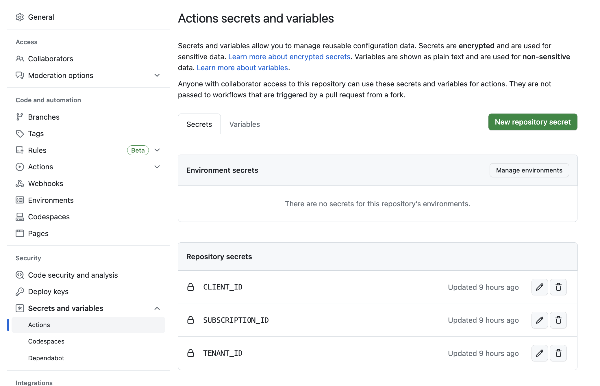

This article will walk you through the steps needed to set up your own blog on GitHub, published to Azure as a static site, and optionally with your own custom domain.

An easy idea for a first blog post - these were the steps I followed to set up this blog!

## Overview
My goals for the blog:
1. Automate as much as possible, so I can **just** focus on writing, with next to 0 maintenance or manual publishing.
1. Keep the cost and complexity down by using a static site instead of a dynamic server.
1. Connect to Azure securely using OpenID Connect, without having to worry about credentials.

## Initial Repo Configuration
To give GitHub Actions the ability to deploy resources to Azure, we must configure OpenID Connect. Because I'm using a custom domain, I have two resource groups, "blog" & "dns" which my CI pipeline needs to be able to deploy to.

The full script is available [here](https://github.com/anthony-c-martin/blog/blob/main/initial_setup.sh), but I'll walk you through it step-by-step.

1. Set bash variables
    ```sh
    # Your Azure tenantId
    tenantId=$"REDACTED"
    # Your Azure subscriptionId
    subId="REDACTED"

    # The name of the GitHub repository owner
    repoOwner="anthony-c-martin"
    # The name of the GitHub repository
    repoName="blog"
    # The name of the Azure Resource Group you wish to deploy blog infrastructure to
    rgName="blog"
    # The name of the Azure Resource Group you wish to deploy DNS infrastructure to
    dnsRgName="dns"
    # The Azure location you wish to host your infrastructure in
    rgLocation="East US 2"
    ```
1. Log in to Az CLI, and create the blog resource group (this assumes the DNS resource group already exists)
    ```sh
    az account set -n "$subId"
    az group create \
      --location "$rgLocation" \
      --name "$rgName"
    ```
1. Create the AAD application that GitHub Actions will use to authenticate
    ```sh
    appCreate=$(az ad app create --display-name $rgName)
    appId=$(echo $appCreate | jq -r '.appId')
    appOid=$(echo $appCreate | jq -r '.id')

    spCreate=$(az ad sp create --id $appId)
    spId=$(echo $spCreate | jq -r '.id')
    ```
1. Give the AAD application RBAC permissions to deploy to the "blog" & "dns" resource groups
    ```sh
    az role assignment create --role 'Owner' --subscription $subId --assignee-object-id $spId --assignee-principal-type ServicePrincipal --scope /subscriptions/$subId/resourceGroups/$rgName
    az role assignment create --role 'Owner' --subscription $subId --assignee-object-id $spId --assignee-principal-type ServicePrincipal --scope /subscriptions/$subId/resourceGroups/$dnsRgName
    ```
1. Configure federated credentials to allow GitHub Actions to authenticate as the AAD application
    ```sh
    repoSubject="repo:$repoOwner/$repoName:ref:refs/heads/main"
    az rest --method POST --uri "https://graph.microsoft.com/beta/applications/$appOid/federatedIdentityCredentials" --body '{"name":"'$repoName'","issuer":"https://token.actions.githubusercontent.com","subject":"'$repoSubject'","description":"GitHub OIDC Connection","audiences":["api://AzureADTokenExchange"]}'
    ```
1. Output the secrets that need configuring in GitHub
    ```sh
    echo "Now configure the following GitHub Actions secrets:"
    echo "  CLIENT_ID: $appId"
    echo "  SUBSCRIPTION_ID: $subId"
    echo "  TENANT_ID: $tenantId"
    ```
1. Log in to the GitHub UI, and configure the 3 secrets as "Actions" secrets
    

## Deploying Infrastructure
My `main.bicep` file is composed of the following. To view the full file, see [here](https://github.com/anthony-c-martin/blog/blob/main/deploy/main.bicep).
1. Parameters
    ```bicep
    @description('The base domain name (e.g. "foo.com")')
    param domainName string

    @description('The child domain name (e.g. "bar")')
    param subDomainName string

    @description('The name of the resource group where the dnsZone resource exists')
    param dnsResourceGroup string

    @description('The location to deploy non-global resources')
    param location string = resourceGroup().location

    var fullSubDomainName = '${subDomainName}.${domainName}'
    ```
1. Deploying the storage account that'll host the blog HTML
    ```bicep
    resource storage 'Microsoft.Storage/storageAccounts@2022-09-01' = {
      name: '${subDomainName}${uniqueString(resourceGroup().id)}'
      location: location
      kind: 'StorageV2'
      sku: {
        name: 'Standard_LRS'
      }
      properties: {
        allowBlobPublicAccess: true
        supportsHttpsTrafficOnly: true
        accessTier: 'Hot'
      }
    }

    var storageHostname = replace(replace(storage.properties.primaryEndpoints.web, 'https://', ''), '/', '')
    ```
1. Creating a CDN account to allow me to use a custom domain name
    ```bicep
    resource cdnProfile 'Microsoft.Cdn/profiles@2021-06-01' = {
      name: subDomainName
      location: 'global'
      sku: {
        name: 'Standard_Microsoft'
      }
    }

    resource cdnEndpoint 'Microsoft.Cdn/profiles/endpoints@2021-06-01' = {
      parent: cdnProfile
      name: replace(fullSubDomainName, '.', '-')
      location: 'global'
      properties: {
        originHostHeader: storageHostname
        // we enforce an http redirect with the rules engine, but this must be set to true for it to work
        isHttpAllowed: true
        isHttpsAllowed: true
        isCompressionEnabled: true
        queryStringCachingBehavior: 'IgnoreQueryString'
        optimizationType: 'GeneralWebDelivery'
        contentTypesToCompress: [
          'application/eot'
          'application/font'
          'application/font-sfnt'
          'application/javascript'
          'application/json'
          'application/opentype'
          'application/otf'
          'application/pkcs7-mime'
          'application/truetype'
          'application/ttf'
          'application/vnd.ms-fontobject'
          'application/xhtml+xml'
          'application/xml'
          'application/xml+rss'
          'application/x-font-opentype'
          'application/x-font-truetype'
          'application/x-font-ttf'
          'application/x-httpd-cgi'
          'application/x-javascript'
          'application/x-mpegurl'
          'application/x-opentype'
          'application/x-otf'
          'application/x-perl'
          'application/x-ttf'
          'font/eot'
          'font/ttf'
          'font/otf'
          'font/opentype'
          'image/svg+xml'
          'text/css'
          'text/csv'
          'text/html'
          'text/javascript'
          'text/js'
          'text/plain'
          'text/richtext'
          'text/tab-separated-values'
          'text/xml'
          'text/x-script'
          'text/x-component'
          'text/x-java-source'
        ]
        origins: [
          {
            name: replace(storageHostname, '.', '-')
            properties: {
              hostName: storageHostname
              originHostHeader: storageHostname
            }
          }
        ]
        deliveryPolicy: {
          rules: [
            {
              name: 'EnforceHTTPS'
              order: 1
              conditions: [
                {
                  name: 'RequestScheme'
                  parameters: {
                    typeName: 'DeliveryRuleRequestSchemeConditionParameters'
                    matchValues: [
                      'HTTP'
                    ]
                    operator: 'Equal'
                    negateCondition: false
                    transforms: []
                  }
                }
              ]
              actions: [
                {
                  name: 'UrlRedirect'
                  parameters: {
                    typeName: 'DeliveryRuleUrlRedirectActionParameters'
                    redirectType: 'Found'
                    destinationProtocol: 'Https'
                  }
                }
              ]
            }
          ]
        }
      }
    }
    ```
1. Configuring DNS records for my custom domain to point to the CDN endpoint
    ```bicep
    module dns 'dns.bicep' = {
      name: 'dns'
      scope: resourceGroup(dnsResourceGroup)
      params: {
        cdnEndpointFqdn: cdnEndpoint.properties.hostName
        cdnEndpointId: cdnEndpoint.id
        domainName: domainName
        subDomainName: subDomainName
      }
    }
    ```
1. Configuring the CDN account with a custom domain, and enabling it for HTTPS
    ```bicep
    resource cdnDomain 'Microsoft.Cdn/profiles/endpoints/customDomains@2021-06-01' = {
      parent: cdnEndpoint
      name: replace(fullSubDomainName, '.', '-')
      properties: {
        hostName: fullSubDomainName
      }
      dependsOn: [
        dns
      ]
    }

    module enableHttps 'cdn-https.bicep' = {
      name: 'cdn-https'
      params: {
        cdnCustomDomainName: cdnDomain.name
        cdnEndpointName: cdnEndpoint.name
        cdnProfileName: cdnProfile.name
        location: location
      }
    }
    ```
1. Outputting the name of the storage account - it'll be used to upload the blog contents later on.
    ```bicep
    output stgAccName string = storage.name
    ```

## Setting up Gatsby
The focus of this article is really on the infrastructure side of things, so I'll skim over this, because there are no doubt many better guides out there for how to install & configure Gatsby.

I picked Gatsby to generate this blog because:
- It's a popular project, so hopefully will remain supported for a long time.
- It's a static site generator - fewer moving parts makes it lower maintenance.
- It gives you the ability to work solely using vanilla Markdown, meaning after the initial setup, no "coding" is required to add or modify blog posts.

I followed the [Gatsby Starter Blog](https://www.gatsbyjs.com/starters/gatsbyjs/gatsby-starter-blog) guide, made a few personalizations, and ended up with the ability to run a single command (`npm run build`) to generate the static site into a single folder that can be easily uploaded to a storage account.

## CI/CD with GitHub Actions
I use the following workflow to ensure my infrastructure in Azure matches the goal state defined in the `.bicep` files on every push to the `main` branch:

```yml
name: Publish

on:
  push:
    branches: [ main ]
  workflow_dispatch:

jobs:
  publish:
    runs-on: ubuntu-latest
    permissions:
      contents: read
      id-token: write

    steps:
    - uses: actions/checkout@v3.2.0

    - uses: actions/setup-node@v3.5.1
      with:
        node-version: 18.x

    - name: Azure Login
      uses: azure/login@v1
      with:
        client-id: ${{ secrets.CLIENT_ID }}
        tenant-id: ${{ secrets.TENANT_ID }}
        subscription-id: ${{ secrets.SUBSCRIPTION_ID }}

    - name: Build
      run: |
        npm ci
        npm run build

    - name: Deploy
      uses: azure/CLI@v1
      with:
        inlineScript: |
          az bicep install

          OUTPUT=$(az deployment group create \
            --resource-group blog \
            --name blog-deploy \
            --parameters deploy/main.bicepparam \
            --template-file deploy/main.bicep \
            --query "[properties.outputs.stgAccName.value]" \
            --output tsv)
          
          STG_ACC_NAME=$(awk 'NR == 1' <<<$OUTPUT)

          az storage blob service-properties update \
            --account-name $STG_ACC_NAME \
            --static-website \
            --404-document 404.html \
            --index-document index.html
          
          az storage blob sync \
            --account-name $STG_ACC_NAME \
            --source public \
            --container "\$web"
```

Some things to note:
* The `permissions` section is necessary to give my GitHub Action the ability to authenticate with Azure.
* Enabling a storage account for the static website feature is not possible through Bicep natively. I've opted to create it with the `az storage blob service-properties` command instead. I could potentially move this into my Bicep files instead with a deployment script.
* The `Build` step uses `npm` to build the static website, and outputs it to a folder named `public` - this is why the `az storage blob sync` command is syncing folder named `public`. I've picked Gatsby as a static site generator, but it would be very easy to drop in a different static site generator, as long as it outputs to a folder named `public`.

## The Result
Making changes is now as simple as adding or modifying the markdown files to the `content/blog` folder in [this blog's GitHub repo](https://github.com/anthony-c-martin/blog). Once I push changes, they are validated and pushed immediately to [blog.ant.ninja](https://blog.ant.ninja)!

Because all of the infrastructure is authored with Bicep, I can start from a totally blank slate if I need to. I could delete all of the resources hosting the blog (CDN, storage account, DNS records), re-run the GitHub Action, and everything will be restored as if nothing happened!

It should also be trivial for anyone else to take this blog post, take my git repo, and create a complete clone with minimal effort. Looking over my last Azure bill, it cost me $0.50 for a full month of hosting using this strategy - not bad!